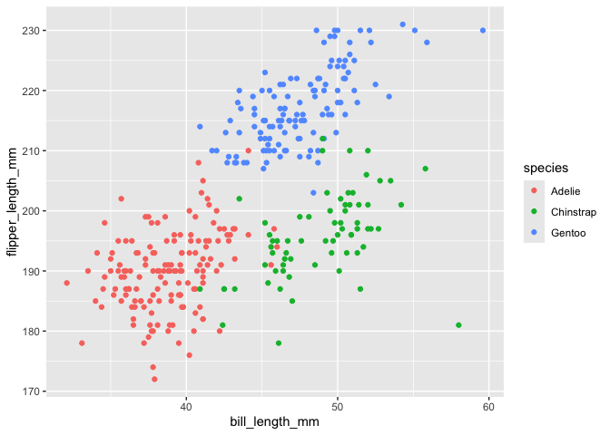

p8105_hw1_sr4354
================
sr4354
2026-09-25

## problem 1

The penguins dataset contains data on penguins from three islands in
Antarctica. There are 344 rows and 8 columns, and each row is one
penguin. The variables include `species` (Adelie, Chinstrap, Gentoo),
`island` (Biscoe, Dream, Torgersen), `sex` (female, male), and `year`
(ranging from 2007, 2009), along with some physical measurements: bill
length, bill depth, flipper length, and body mass. The mean flipper
length is 200.9152047 mm, and the mean bill length is 43.9219298 mm.

``` r
ggplot(penguins, aes(x = bill_length_mm, y = flipper_length_mm, color = species)) +
  geom_point()
```

    ## Warning: Removed 2 rows containing missing values or values outside the scale range
    ## (`geom_point()`).

<!-- -->

``` r
ggsave("flipper_vs_bill.png")
```

    ## Saving 7 x 5 in image

    ## Warning: Removed 2 rows containing missing values or values outside the scale range
    ## (`geom_point()`).
